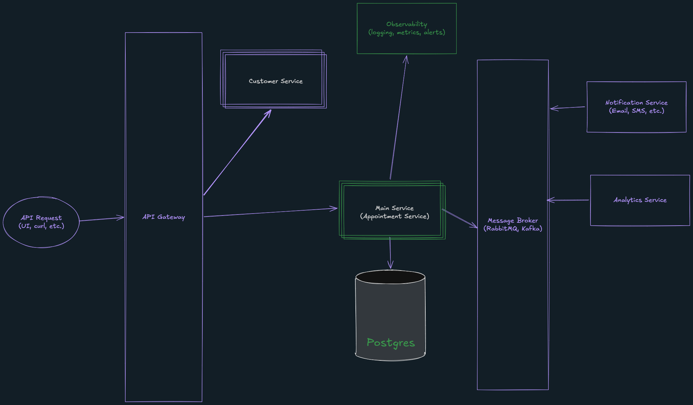

## Keyloop interview process coding challenge

- Submitter: Nguyen Anh Vu (nganhvu2161@gmail.com)
- Task choose: **Scenario A** (Backend focus, Golang)

## Assumptions & Requirements

### Assumptions

- **Seeding**: some entities like `Dealership`, `ServiceBay`, `Customer`, `ServiceType`, `Vehicle` are pre-seeded and **do not have any API for CRUD (un-modifiable)**
	- These resources should be administrated in another microservice (e.g. Resources Management Service) instead of this `AppointmentService`, but we put them inside this service for simplicity
- **Service Duration**: Each `ServiceType` has a fixed duration in minutes (e.g., Oil Change = 60 min, Full Service = 180 min)
- **Operating Hours:** Dealerships operate between `[08:00, 18:00]` locally based on `Dealership.timezone`, can open at weekend (default). Bookings outside these hours will be rejected.
- **Technician Qualifications:** Technicians have a many-to-many relationship with Service Types to display that this technician can be booked for this service type
- **Dealership Scope**: a specific ServiceBay or a specific Technician belong to only one Dealership. Availability checks are scoped to the requested dealership only.
- **Booking Request**: A booking request contains:
    - Must: `CustomerID`, `DealershipID`, `TechnicianID`, `ServiceType`, `StartAt`
    - Optional: `VehicleID`
- **Booking Status**: A booking can have the following statuses:
    - `created`: booking created, a staff might do a phone call to the customer for confirmation
    - `cancelled`: customer or staff cancelled the booking (no response from the customer)
    - `completed`: staff completed the service
- **Booking Conflict**: Incoming booking of the same either a `ServiceBay` or a `Technican` with an existing one is considered conflict if:
    - `RequestedStart < ExistingEnd AND RequestedEnd > ExistingStart`
- **Booking Adjustment**: A booking cannot be adjusted (change time, technician) after it is created. But it can be cancelled and book again with new parameters.
- **Authentication**: No auth in this implementation, A `customer_id` is passed in the request body. Auth is noted as a future concern.
	- Auth should be maintained by another service (of another team), out of scope of this service
- **Timezone**: The requested appointment time is converted to UTC and store in database. When checking availability, we convert the dealership's operating hours in the dealership's timezone to UTC and check for conflicts.

### Requirements for the challenge

#### Functional requirements

- A user can request a service appointment specifying: vehicle, service type, dealership, and desired datetime.
- Before confirming, the system must check that **both** a `ServiceBay` AND a `qualified Technician` are available for the **full duration** of the service.
- On success, persist an Appointment record linking: customer, vehicle, technician, service bay, service type, and time slot.
- Expose the solution as a **RESTful API** (backend focus).
	- Mock or stub the client-side with cURL examples or an OpenAPI spec.
- Include a test suite validating core business logic.
- Include a README with build/run/test instructions and an AI Collaboration Narrative section.

#### Non-functional requirements

- **Scalability & Performance:** Design for future growth, highlight separation.
- **Reliability:** Ensure data integrity (no double-bookings).
- **Observability:** logging / metrics / tracing.

## System design document

### Components



> **Note:** The diagram above is a high-level system design for the possible product big picture. In a real product, there would be more components such as Cache, Resources Management Service, etc. 

> **Scope note:** For this implementation, only the **Appointment Service** and some **Observability tools** are built. All other components are described for architectural completeness and future extensibility.

- **API Request (UI, cURL, etc.):** The entry point for any client interaction — a browser-based frontend, a mobile app, or direct cURL/API calls used in this implementation as the mock client layer.

- **API Gateway:** Acts as the single entry point for all incoming traffic. Responsible for routing requests to the appropriate downstream service, and in a production setup would handle cross-cutting concerns such as rate limiting, authentication/authorization (e.g., JWT validation), SSL termination, and request logging. For this implementation, it is assumed as a pass-through layer (e.g., a reverse proxy or AWS API Gateway).

- **Customer Service:** A separate microservice responsible for managing customer identity and profile data. In this implementation, customers are pre-seeded directly in the Appointment Service's database. In a production architecture, the Appointment Service would call this service to validate a `customer_id` before processing a booking.

- **Main Service (Appointment Service):** The core of this implementation. Handles all business logic including:
  - Validating booking requests against operating hours
  - Checking real-time availability of both a `ServiceBay` and a qualified `Technician` for the full service duration
  - Persisting confirmed `Appointment` records to the database
  - Publishing domain events (e.g., `appointment.confirmed`) to the Message Broker upon success (**not implemented**, out of scope)

- **PostgreSQL:** The persistent relational database for the Appointment Service. Stores all entities including `Appointment`, `Technician`, `ServiceBay`, `ServiceType`, `Vehicle`, `Customer`, and `Dealership`. PostgreSQL is chosen for its strong ACID guarantees, which are critical for preventing double-bookings via transactional locking.

- **Observability:** A cross-cutting concern that receives telemetry from the Appointment Service. In a production setup this would consist of:
  - **Structured logging** (e.g., `slog`, `zap`) shipped to a log aggregator (e.g., Otel collector, Loki, CloudWatch)
  - **Tracing**: OpenTelemetry (OTel) is used for distributed tracing. It collects trace data from the Appointment Service and sends it to a tracing backend (e.g Loki, or could be other tracing tools). This allows developers to trace requests as they propagate through the system, identify bottlenecks, and debug issues.
  - **Metrics**: count requests, success / failure rates (not implemented in this implementation)
  - **Alerting** on error spikes or availability check failure rates (e.g., Grafana alerts)
  - For this implementation, structured logging to stdout is included as a foundation. Log collector will pull logs and send to a dedicated log storage.

- **Message Broker (RabbitMQ / Kafka):** An asynchronous event bus that decouples the Appointment Service from downstream consumers. After a booking is confirmed, the Appointment Service publishes an event (e.g., `appointment.confirmed`) and returns immediately — downstream services consume at their own pace, improving resilience and scalability (not implemented, out of scope).

- **Notification Service (Email, SMS, etc.):** Consumes events (e.g. `appointment.confirmed` )from the Message Broker to send customer-facing communications. Fully decoupled from the core booking flow so that a notification failure never impacts booking success (not implemented, out of scope).

- **Analytics Service:** Consumes appointment events to build business intelligence — e.g., technician utilization rates, peak booking hours, aging service bay data (not implemented, out of scope).

### Entities

> Field ends with `?` is a nullable (optional) field. Most of the entities are simplified for the purpose of this challenge.

- `Dealership(id, uuid, name, open_time, close_time, is_weekend_open, timezone)`

- `ServiceBay(id, uuid, dealership_id, name)`

- `ServiceType(id, uuid, name, duration_minutes)`

- `Technician(id, uuid, dealership_id, name)`

- `TechnicianServiceType(technician_id, service_type_id)`
    - many-to-many table between `Technician` and `ServiceType`

- `Customer(id, uuid, name, email, phone)`

- `Vehicle(id, uuid, customer_id?, name)`

- `Appointment(id, uuid, customer_id, vehicle_id?, dealership_id, technician_id, service_bay_id, service_type_id, status,start_at, end_at, description)`

- Table declarations and seeding can be seen at `app/db/migrations`

## Folder structure

- Folder structure follows the golang standard layout and repository pattern:

```
cmd (server entry point) -> route -> controller (handler) -> service -> repository -> db
```
## AI Collaboration Narrative

Throughout this project, AI (Gemini) was used as a **pair-programming partner** — not as a code generator. Every major decision went through a deliberate loop of **prompt → critique → refine → implement**, with me (the developer) retaining full ownership of the architecture and business logic.

### Phase 1 — Requirement Clarification & Scenario Selection

I started by asking the AI to break down all three challenge scenarios, listing the expected outcomes and the skill sets each one targets. The AI initially leaned toward **Scenario C**, but I pointed out that C is primarily frontend-focused (data display, UI interaction), which didn't match my backend-oriented experience. After discussion, we aligned on **Scenario A** as the best fit for demonstrating backend design, concurrency handling, and data integrity.

### Phase 2 — Assumptions & Requirements Gathering

Before writing any code or designing any system architecture, I asked the AI to enumerate all assumptions and articulate the functional and non-functional requirements. This was intentional — nailing down assumptions (e.g., fixed service durations, dealership-scoped availability, booking conflict overlap formula) early prevented misunderstandings from creeping into the business logic later. The result was the **Assumptions & Requirements** section in this README, which served as the contract for all subsequent implementation.

### Phase 3 — System Design & Architecture

I asked the AI to draft descriptions for each component in the system design diagram. I then reviewed each one, specified which components would actually be implemented (Appointment Service, PostgreSQL, Observability basics) versus out-of-scope (Message Broker, Notification Service, Analytics), and revised the language to reflect that distinction clearly.

### Phase 4 — Implementation

- **Repository layer**: I built the folder structure + base repository (`base.go`, `base_common.go`) myself, then instructed the AI to follow the same conventions for all remaining repository implementations. This ensured consistency across the data layer.
- **Service layer**: The core booking logic — including technician qualification checks, operating-hour validation, and transactional locking for double-booking prevention — was co-developed iteratively. I would outline the logic, AI would draft code, and I would review, correct, and refactor as needed.

### Phase 5 — Testing

- **Integration tests**: I asked the AI to write integration tests using the existing test database setup infrastructure. The initial tests were verbose, so I requested a refactor toward table-driven tests with helper methods for conciseness.
- **Concurrency tests**: To validate the double-booking prevention logic under race conditions, I asked the AI to add concurrent booking test cases. This was critical to prove that the `SELECT ... FOR UPDATE` locking mechanism works correctly.
- **Fixed timestamps**: I instructed the AI to use fixed dates instead of `time.Now()` in tests to eliminate flakiness caused by time-dependent assertions.

### Phase 6 — Documentation & Review

The README structure, system design descriptions, and API documentation were all refined through AI collaboration — I provided the content direction and the AI helped with articulation and formatting. The final review pass ensured everything matched the actual implementation.

### Phase 7 - Dockerization

- **Dockerfile**: AI helped in creating the dockerfile. I direct it to use multi-stage build, export both the server and the migrate binary to the final image.
- **docker-compose.yml**: AI helped in creating the docker-compose.yml file to run the server and the database together. I also add the migration step to run automatically when the server starts.

## How to run

- Before running any commmand, make sure to `cd ./app` if you haven't (you dont need this step if start with `docker-compose`)

### Start server locally

> Most of the config (app port, db port, db name, etc.) can be set via environment variables. See `app/.env.example` for all the available environment variables.

- The server will run on port 8080 (default) and require a postgresql database running on port 5432 (default)
- For local development, copy `.env.example` to `.env` and change the values (if needed).
- I use [Taskfile](https://taskfile.dev/) as a task runner to run common commands.
  - If you dont have `Taskfile` installed, you can open `app/Taskfile.yml` to see the commands and run them directly.
- After setting up all env and database for local:
  - Run `task migrate-up` to migrate database schema and seeding.
    - Or `go run ./cmd/sql-migrate up --env=development --db=postgres`
  - Run `task dev` to start the server.
    - Or `go run ./cmd/appointment-service`

### Run test

- To better test the business logic and transactions handling, this repo requires a postgres database for testing, running on port 5432 (default)
- For testing, copy `.env.test.example` to `.env.test` and change the values (if needed).
  - `.env.test` will override the values in `.env` (if duplicate key)
- After setting up all env and database for testing:
  - Run `task migrate-up` to migrate `test database`
    - Or `go run ./cmd/sql-migrate up --env=test --db=postgres`
  - Run `task test` to run all the tests.
    - Or `go test ./...`
    - This will run all the unit tests and integration tests.
    - Currently, there are not much unit test created.
  - Run `task test-integration` to run integration tests only.
    - Or `go test ./integration-test`
    - Integration tests cover some business logic, transactions, and database interactions.

### Start with docker-compose

- Run `docker-compose up -d` to start the server and the database (with auto migration).
- Open `http://localhost:3000` to access to Grafana Dashboard (logging, tracing)
- Query to `http://localhost:8080` to access to the API

## cURL Examples

> **Base URL**: `http://localhost:8080` (default port). Adjust if you configured a different `APP_PORT`.
>
> All examples below use the **seeded data** from `app/db/migrations/002_seeding.sql`.

### 1. Book an Appointment

Book an Oil Change (60 min) for customer "John Doe" at "Downtown Auto" with technician "Alice":

```bash
curl -X POST http://localhost:8080/appointments \
  -H "Content-Type: application/json" \
  -d '{
    "customer_id": 1,
    "dealership_id": 1,
    "service_type_id": 1,
    "technician_id": 1,
    "vehicle_id": 1,
    "start_at": "2026-03-25T09:00:00+07:00"
  }'
```

**Expected response** (`200 OK`):

```json
{
  "uuid": "<generated-uuid>",
  "status": "created",
  "description": null,
  "start_at": "2026-03-25T02:00:00Z",
  "end_at": "2026-03-25T03:00:00Z"
}
```

Book without a vehicle (optional field):

```bash
curl -X POST http://localhost:8080/appointments \
  -H "Content-Type: application/json" \
  -d '{
    "customer_id": 2,
    "dealership_id": 1,
    "service_type_id": 3,
    "technician_id": 2,
    "start_at": "2026-03-25T10:00:00+07:00"
  }'
```

### 2. List All Appointments

```bash
curl http://localhost:8080/appointments
```

**Expected response** (`200 OK`):

```json
{
  "size": 1,
  "items": [
    {
      "uuid": "<generated-uuid>",
      "status": "created",
      "description": null,
      "start_at": "2026-03-25T02:00:00Z",
      "end_at": "2026-03-25T03:00:00Z"
    }
  ]
}
```

### 3. Cancel an Appointment

Replace `<appointment-uuid>` with the UUID from the booking response:

```bash
curl -X POST http://localhost:8080/appointments/<appointment-uuid>/cancel \
  -H "Content-Type: application/json" \
  -d '{
    "description": "Customer requested cancellation"
  }'
```

**Expected response** (`200 OK`):

```json
{
  "uuid": "<appointment-uuid>",
  "status": "cancelled",
  "description": "Customer requested cancellation",
  "start_at": "2026-03-25T02:00:00Z",
  "end_at": "2026-03-25T03:00:00Z"
}
```

### 4. Complete an Appointment

```bash
curl -X POST http://localhost:8080/appointments/<appointment-uuid>/complete \
  -H "Content-Type: application/json" \
  -d '{
    "description": "Service completed successfully"
  }'
```

**Expected response** (`200 OK`):

```json
{
  "uuid": "<appointment-uuid>",
  "status": "completed",
  "description": "Service completed successfully",
  "start_at": "2026-03-25T02:00:00Z",
  "end_at": "2026-03-25T03:00:00Z"
}
```

### Error Examples

**Booking outside operating hours** (`400 Bad Request`):

```bash
curl -X POST http://localhost:8080/appointments \
  -H "Content-Type: application/json" \
  -d '{
    "customer_id": 1,
    "dealership_id": 1,
    "service_type_id": 1,
    "technician_id": 1,
    "start_at": "2026-03-25T20:00:00+07:00"
  }'
```

**Missing required fields** (`400 Bad Request`):

```bash
curl -X POST http://localhost:8080/appointments \
  -H "Content-Type: application/json" \
  -d '{
    "customer_id": 1
  }'
```

**Technician not belonging to dealership** (`400 Bad Request`):

```bash
curl -X POST http://localhost:8080/appointments \
  -H "Content-Type: application/json" \
  -d '{
    "customer_id": 1,
    "dealership_id": 1,
    "service_type_id": 1,
    "technician_id": 3,
    "start_at": "2026-03-25T09:00:00+07:00"
  }'
```
